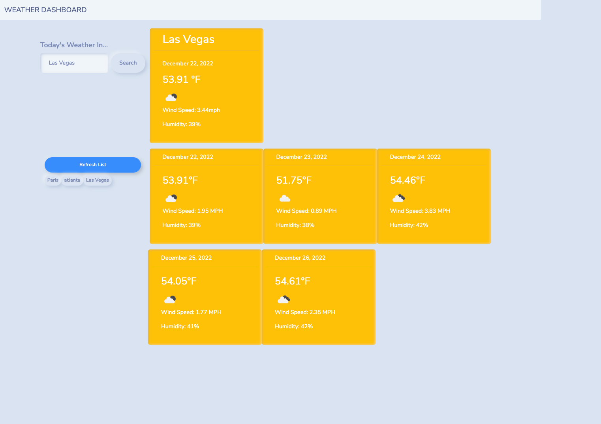

# Dashboard Weather Application: Search Your City

## Description of Project

For this application, we were tasked with creating an interactive dashboard that can display a weather forecast for any city a user may type into the search-bar! We utilized a custom API key and the [5 Day Weather Forecast](https://openweathermap.org/forecast5) to retrieve weather data.

### Live Application Link

* Click this [link](https://www.owasp.org/index.php/Password_special_characters) to access the password generator live.

## Application Mock-Up

This is an image of the web application appearance after refactoring:

## Contact Information

If you want to contact me you can reach me at .
